# FirstWave → Datamorph.ai Pipeline Simulation

> A node-by-node reconstruction of the FirstWave 8-stage EMS staging pipeline,
> expressed in **datamorph.ai** workflow primitives (Source / Processor / Sink / Task),
> ready to rebuild on `app-v2.datamorph.ai`.
>
> Workflow name in screenshots: **`test_predictive_ems_staging`**
> First pipeline task: **`duckdb_pipeline_1`**
>
> Source of truth: `pipeline/01_ingest_clean.py` → `pipeline/08_counterfactual_precompute.py`

---

## 0. How to read this document

Datamorph organizes work in two layers:

| Layer | What it is | Datamorph menu |
|-------|-----------|----------------|
| **Workflow (Tasks)** | The outer DAG. Boxes that run in order. | `Tasks ▾` → Actions / Pipelines / Notifications / Control |
| **Pipeline (nodes)** | Inside a *DuckDB Pipeline* task: a graph of **Source → Processor → Sink** nodes wired by *SQL relations*. | `Source ▾` · `Processor ▾` · `Sink ▾` |

**Node palette (exact, from your screenshots):**

```
SOURCE ▾                 PROCESSOR ▾            SINK ▾                 TASKS ▾
 FILE                     SQL                    FILE                   ACTIONS
  ├ CSV                    └ SQL                   ├ CSV                  ├ Bash
  ├ Parquet               COLUMNS                  ├ Parquet              ├ Java
  ├ JSON                   ├ Schema                ├ JSON                 └ Python
  └ XML                    └ Flatten/Explode       └ XML                 PIPELINES
 LAKEHOUSE                QUALITY                 LAKEHOUSE               ├ DuckDB Pipeline
  ├ Delta                  └ Quality Check         ├ Delta                └ Spark Pipeline
  ├ Iceberg                                        ├ Iceberg             NOTIFICATIONS
  └ DuckLake                                       └ DuckLake             ├ Email
 DATABASE                                         DATABASE               └ Slack
  └ PostgreSQL                                     └ PostgreSQL          CONTROL
                                                                         └ Branch
```

**Legend for the Mermaid diagrams below:**

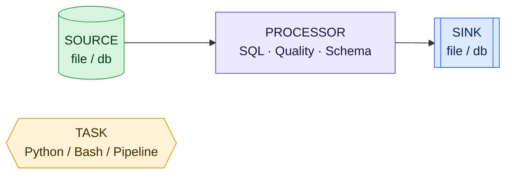

- **Green rounded** = Source node
- **Purple rounded** = Processor node (SQL / Quality / Schema / Flatten)
- **Blue square** = Sink node
- **Yellow hexagon** = Workflow-level Task (Python/Bash/DuckDB Pipeline/etc.)

> Throughout, `proc_sql_N` matches datamorph's auto-naming (`proc_sql_1`, `proc_sql_2`, …)
> and a Source/Sink node's **NAME** is shown inside the box.

---

## 1. Top-level Workflow DAG — `test_predictive_ems_staging`

The full pipeline is **8 stages**. Four are pure-SQL (→ **DuckDB Pipeline** tasks),
four are ML/graph/optimization (→ **Python** tasks). Stage 06 runs in parallel.

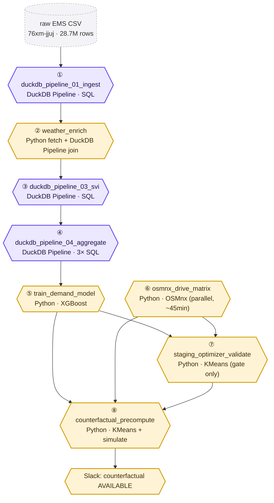

**Why the split:** datamorph's *DuckDB Pipeline* runs SQL over file/db relations — perfect
for stages 01–04 (all DuckDB `COPY (SELECT …)` today). Stages 05–08 train XGBoost,
build an OSMnx road graph, and run weighted K-Means — these become **Python** tasks
(`Tasks ▾ → Actions → Python`) that read/write the same Parquet/PKL artifacts.

**Artifact bus (what flows between tasks):**

| Edge | Artifact handed off | Format |
|------|--------------------|--------|
| ① → ② | `incidents_cleaned.parquet` | Parquet |
| ② → ③ | `incidents_cleaned.parquet` (+11 feature cols) | Parquet |
| ③ → ④ | `incidents_cleaned.parquet` (+`svi_score`) | Parquet |
| ④ → ⑤/⑦/⑧ | `incidents_aggregated.parquet`, `zone_baselines.parquet`, `zone_stats.parquet` | Parquet |
| ⑤ → ⑦/⑧ | `demand_model.pkl` | Pickle |
| ⑥ → ⑦/⑧ | `drive_time_matrix.pkl` | Pickle |
| ⑧ → Slack | `counterfactual_summary.parquet`, `counterfactual_raw.parquet` | Parquet |

---

## 2. Stage ① — Ingest & Clean  (`duckdb_pipeline_01_ingest`)

**Source script:** `pipeline/01_ingest_clean.py`
**Datamorph task type:** DuckDB Pipeline
**Goal:** 28.7M raw rows → ~7.1M clean rows with time features + train/test/exclude split.

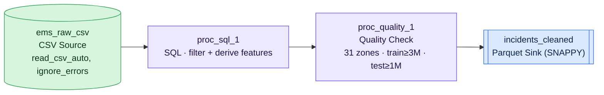

### Node configuration

| Node | Type | NAME | SQL RELATIONS (inputs) | Notes |
|------|------|------|------------------------|-------|
| Source | CSV | `ems_raw_csv` | — | path = raw EMS CSV; `ignore_errors=true` |
| Processor | SQL | `proc_sql_1` | `ems_raw_csv` | the big SELECT/WHERE below |
| Processor | Quality Check | `proc_quality_1` | `proc_sql_1` | row-count + zone-count assertions |
| Sink | Parquet | `incidents_cleaned` | `proc_quality_1` | `pipeline/data/incidents_cleaned.parquet` |

### `proc_sql_1` — SQL body

> DuckDB `dayofweek()` is 0=Sun…6=Sat; `(dow + 6) % 7` rebases to 0=Mon…6=Sun (CLAUDE.md convention).

```sql
SELECT
    INCIDENT_DATETIME                                   AS incident_dt,
    CAD_INCIDENT_ID,
    INCIDENT_DISPATCH_AREA,
    BOROUGH,
    INCIDENT_RESPONSE_SECONDS_QY::DOUBLE                AS INCIDENT_RESPONSE_SECONDS_QY,
    INCIDENT_TRAVEL_TM_SECONDS_QY::DOUBLE               AS INCIDENT_TRAVEL_TM_SECONDS_QY,
    DISPATCH_RESPONSE_SECONDS_QY::DOUBLE                AS DISPATCH_RESPONSE_SECONDS_QY,
    FINAL_SEVERITY_LEVEL_CODE::INTEGER                  AS FINAL_SEVERITY_LEVEL_CODE,
    HELD_INDICATOR,

    -- time features
    EXTRACT(year  FROM INCIDENT_DATETIME)::INTEGER      AS year,
    EXTRACT(month FROM INCIDENT_DATETIME)::INTEGER      AS month,
    (EXTRACT(dow  FROM INCIDENT_DATETIME)::INTEGER + 6) % 7 AS dayofweek,
    EXTRACT(hour  FROM INCIDENT_DATETIME)::INTEGER      AS hour,
    date_trunc('hour', INCIDENT_DATETIME)              AS date_hour,
    CAST(INCIDENT_DATETIME AS DATE)                    AS incident_date,

    -- derived flags
    CASE WHEN (EXTRACT(dow FROM INCIDENT_DATETIME)::INTEGER + 6) % 7 IN (5,6)
         THEN 1 ELSE 0 END                              AS is_weekend,
    CASE WHEN FINAL_SEVERITY_LEVEL_CODE::INTEGER IN (1,2)
         THEN 1 ELSE 0 END                              AS is_high_acuity,
    CASE WHEN HELD_INDICATOR = 'Y' THEN 1 ELSE 0 END    AS is_held,
    CASE WHEN EXTRACT(year FROM INCIDENT_DATETIME) = 2020
         THEN 1 ELSE 0 END                              AS is_covid_year,

    -- train / test / exclude split
    CASE
        WHEN EXTRACT(year FROM INCIDENT_DATETIME) = 2023 THEN 'test'
        WHEN EXTRACT(year FROM INCIDENT_DATETIME) = 2020 THEN 'exclude'
        WHEN EXTRACT(year FROM INCIDENT_DATETIME) BETWEEN 2019 AND 2022 THEN 'train'
        ELSE 'exclude'
    END                                                 AS split
FROM ems_raw_csv
WHERE
    VALID_INCIDENT_RSPNS_TIME_INDC = 'Y'
    AND VALID_DISPATCH_RSPNS_TIME_INDC = 'Y'
    AND REOPEN_INDICATOR   = 'N'
    AND TRANSFER_INDICATOR = 'N'
    AND STANDBY_INDICATOR  = 'N'
    AND TRY_CAST(INCIDENT_RESPONSE_SECONDS_QY AS DOUBLE) BETWEEN 1 AND 7200
    AND BOROUGH IS NOT NULL
    AND BOROUGH != 'UNKNOWN'
    AND INCIDENT_DISPATCH_AREA IN (
        'B1','B2','B3','B4','B5',
        'K1','K2','K3','K4','K5','K6','K7',
        'M1','M2','M3','M4','M5','M6','M7','M8','M9',
        'Q1','Q2','Q3','Q4','Q5','Q6','Q7',
        'S1','S2','S3'
    )
    AND (
           (BOROUGH = 'BRONX'       AND INCIDENT_DISPATCH_AREA LIKE 'B%')
        OR (BOROUGH = 'BROOKLYN'    AND INCIDENT_DISPATCH_AREA LIKE 'K%')
        OR (BOROUGH = 'MANHATTAN'   AND INCIDENT_DISPATCH_AREA LIKE 'M%')
        OR (BOROUGH = 'QUEENS'      AND INCIDENT_DISPATCH_AREA LIKE 'Q%')
        OR (BOROUGH LIKE '%STATEN%' AND INCIDENT_DISPATCH_AREA LIKE 'S%')
    )
    AND INCIDENT_DATETIME IS NOT NULL
```

### `proc_quality_1` — Quality Check rules

| Rule | Expression | Expectation |
|------|-----------|-------------|
| Distinct zones | `COUNT(DISTINCT INCIDENT_DISPATCH_AREA) = 31` | exactly 31 |
| Training volume | `COUNT(*) WHERE split='train' >= 3_000_000` | ~5.6M |
| Holdout volume | `COUNT(*) WHERE split='test'  >= 1_000_000` | ~1.5M |
| Zone↔borough | no rows where prefix mismatches borough | 0 violations |

---

## 3. Stage ② — Weather + Feature Enrichment  (`weather_enrich`)

**Source script:** `pipeline/02_weather_merge.py`
**Datamorph pattern:** a **Python** task builds 5 lookup Parquets from APIs/hardcoded
calendars, then a **DuckDB Pipeline** joins all of them onto the incident stream in one pass.
Adds 11 columns: `temperature_2m, precipitation, windspeed_10m, weathercode,
is_severe_weather, is_extreme_heat, is_heat_emergency, is_holiday, is_school_day,
is_major_event, subway_disruption_idx`.

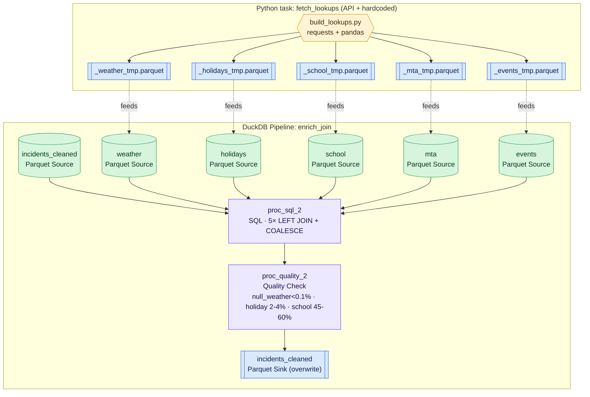

### External inputs the Python task pulls

| Lookup | Source | Datamorph note |
|--------|--------|---------------|
| Weather (hourly 2019–2023) | Open-Meteo `archive-api.open-meteo.com/v1/archive` @ (40.7128, -74.0060) | derive `is_severe_weather` (WMO set), `is_extreme_heat` (≥35°C), `is_heat_emergency` (rolling-24h ≥32.2°C) |
| Holidays | **hardcoded** federal + NYC (Election Day, Rosh Hashanah, Yom Kippur) | one row per `holiday_date` |
| School calendar | **hardcoded** NYC DOE sessions + closures | one row per `school_date` w/ `is_school_day` |
| Special events | NYC Open Data `bkfu-528j` (Permitted Events) | filter `MAJOR_EVENT_TYPES`, expand to (date × borough-prefix) |
| MTA disruption | data.ny.gov `i8rn-y4np` (pre-2020) + `j6d2-s8m2` (2020+) | monthly count → min-max normalized `subway_disruption_idx` 0–1 |

> These are network/Python operations (date expansion, normalization, column auto-detection),
> which is why the fetch lives in a **Python** task rather than a SQL Source.

### `proc_sql_2` — SQL body (the single join pass)

Relations: `incidents_cleaned, weather, holidays, school, events, mta`

```sql
SELECT
    inc.*,
    COALESCE(w.temperature_2m,      15.0) AS temperature_2m,
    COALESCE(w.precipitation,        0.0) AS precipitation,
    COALESCE(w.windspeed_10m,       10.0) AS windspeed_10m,
    COALESCE(w.weathercode,            0) AS weathercode,
    COALESCE(w.is_severe_weather,      0) AS is_severe_weather,
    COALESCE(w.is_extreme_heat,        0) AS is_extreme_heat,
    COALESCE(w.is_heat_emergency,      0) AS is_heat_emergency,
    COALESCE(h.is_holiday,             0) AS is_holiday,
    COALESCE(sc.is_school_day,         0) AS is_school_day,
    COALESCE(ev.is_major_event,        0) AS is_major_event,
    COALESCE(mta.subway_disruption_idx, 0.5) AS subway_disruption_idx
FROM incidents_cleaned AS inc
LEFT JOIN weather  AS w  ON inc.date_hour = w.date_hour
LEFT JOIN holidays AS h  ON CAST(inc.date_hour AS DATE) = h.holiday_date
LEFT JOIN school   AS sc ON CAST(inc.date_hour AS DATE) = sc.school_date
LEFT JOIN events   AS ev ON CAST(inc.date_hour AS DATE) = ev.event_date
                         AND LEFT(inc.INCIDENT_DISPATCH_AREA, 1) = ev.zone_prefix
LEFT JOIN mta      AS mta ON YEAR(inc.date_hour)  = mta.year
                          AND MONTH(inc.date_hour) = mta.month_num
```

### `proc_quality_2` — Quality Check rules

| Rule | Expectation |
|------|-------------|
| `AVG(temperature_2m IS NULL)` | < 0.1% null weather |
| `AVG(is_holiday) * 100` | 2–4% |
| `AVG(is_school_day) * 100` | 45–60% |
| `AVG(is_major_event) * 100` | 5–15% (non-fatal if download skipped) |
| `% rows where subway_disruption_idx = 0.5` | < 99% (else MTA join failed) |

---

## 4. Stage ③ — SVI Spatial Join  (`duckdb_pipeline_03_svi`)

**Source script:** `pipeline/03_spatial_join.py`
**Datamorph task type:** DuckDB Pipeline
**Goal:** attach CDC Social Vulnerability Index per zone (hardcoded 31-row lookup).

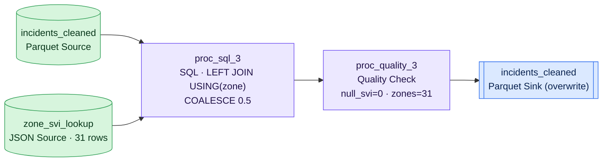

### Node configuration

| Node | Type | NAME | RELATIONS | Notes |
|------|------|------|-----------|-------|
| Source | Parquet | `incidents_cleaned` | — | from Stage ② |
| Source | JSON | `zone_svi_lookup` | — | `data/zone_svi_lookup.json` — `{INCIDENT_DISPATCH_AREA, svi_score}` |
| Processor | SQL | `proc_sql_3` | `incidents_cleaned, zone_svi_lookup` | below |
| Processor | Quality Check | `proc_quality_3` | `proc_sql_3` | 0 null SVI, 31 zones |
| Sink | Parquet | `incidents_cleaned` | `proc_quality_3` | overwrite |

### `proc_sql_3` — SQL body

```sql
SELECT
    inc.*,
    COALESCE(s.svi_score, 0.5) AS svi_score
FROM incidents_cleaned AS inc
LEFT JOIN zone_svi_lookup AS s
    USING (INCIDENT_DISPATCH_AREA)
```

> The SVI table (`ZONE_SVI`) is 31 fixed values, e.g. `B1=0.94 … M5=0.12`. In datamorph,
> seed it as a small **JSON Source** (or an inline `VALUES` CTE in `proc_sql_3`).

---

## 5. Stage ④ — Aggregation  (`duckdb_pipeline_04_aggregate`)

**Source script:** `pipeline/04_aggregate.py`
**Datamorph task type:** DuckDB Pipeline (one Source fans out to **three** SQL processors → three sinks).
**Goal:** build the model training table + two backend artifacts.

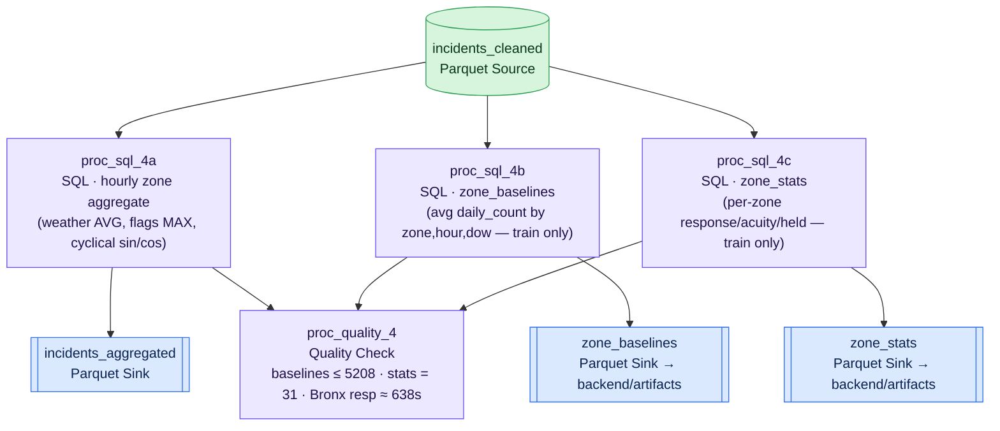

### `proc_sql_4a` — Hourly zone aggregation → `incidents_aggregated`

```sql
SELECT
    INCIDENT_DISPATCH_AREA, BOROUGH, year, month, dayofweek, hour,
    is_weekend, split,

    ROUND(AVG(temperature_2m), 2)        AS temperature_2m,
    ROUND(AVG(precipitation),  3)        AS precipitation,
    ROUND(AVG(windspeed_10m),  2)        AS windspeed_10m,

    -- hour-level facts: MAX = "any incident in this bin carried the flag"
    MAX(is_severe_weather)               AS is_severe_weather,
    MAX(is_extreme_heat)                 AS is_extreme_heat,
    MAX(is_heat_emergency)               AS is_heat_emergency,
    MAX(is_holiday)                      AS is_holiday,
    MAX(is_school_day)                   AS is_school_day,
    MAX(is_major_event)                  AS is_major_event,
    ROUND(AVG(subway_disruption_idx), 4) AS subway_disruption_idx,
    ROUND(AVG(svi_score), 4)             AS svi_score,

    COUNT(CAD_INCIDENT_ID)               AS incident_count,
    AVG(INCIDENT_RESPONSE_SECONDS_QY)    AS avg_response_seconds,
    AVG(INCIDENT_TRAVEL_TM_SECONDS_QY)   AS avg_travel_seconds,
    AVG(DISPATCH_RESPONSE_SECONDS_QY)    AS avg_dispatch_seconds,
    SUM(is_high_acuity)                  AS high_acuity_count,
    SUM(is_held)                         AS held_count,
    MEDIAN(INCIDENT_RESPONSE_SECONDS_QY) AS median_response_seconds,

    -- cyclical time features for XGBoost
    SIN(2 * PI() * hour / 24)            AS hour_sin,
    COS(2 * PI() * hour / 24)            AS hour_cos,
    SIN(2 * PI() * dayofweek / 7)        AS dow_sin,
    COS(2 * PI() * dayofweek / 7)        AS dow_cos,
    SIN(2 * PI() * month / 12)           AS month_sin,
    COS(2 * PI() * month / 12)           AS month_cos
FROM incidents_cleaned
WHERE split IN ('train', 'test')
GROUP BY INCIDENT_DISPATCH_AREA, BOROUGH, year, month, dayofweek, hour, is_weekend, split
```

### `proc_sql_4b` — Zone baselines (the #1 model feature) → `zone_baselines`

```sql
SELECT
    INCIDENT_DISPATCH_AREA, hour, dayofweek,
    AVG(daily_count) AS zone_baseline_avg
FROM (
    SELECT INCIDENT_DISPATCH_AREA, hour, dayofweek, incident_date,
           COUNT(CAD_INCIDENT_ID) AS daily_count
    FROM incidents_cleaned
    WHERE split = 'train'
    GROUP BY INCIDENT_DISPATCH_AREA, hour, dayofweek, incident_date
)
GROUP BY INCIDENT_DISPATCH_AREA, hour, dayofweek
```

### `proc_sql_4c` — Zone stats → `zone_stats`

```sql
SELECT
    INCIDENT_DISPATCH_AREA, BOROUGH,
    AVG(svi_score)                     AS svi_score,
    AVG(INCIDENT_RESPONSE_SECONDS_QY)  AS avg_response_seconds,
    AVG(INCIDENT_TRAVEL_TM_SECONDS_QY) AS avg_travel_seconds,
    AVG(DISPATCH_RESPONSE_SECONDS_QY)  AS avg_dispatch_seconds,
    AVG(is_high_acuity)                AS high_acuity_ratio,
    AVG(is_held)                       AS held_ratio,
    COUNT(CAD_INCIDENT_ID)             AS total_incidents
FROM incidents_cleaned
WHERE split = 'train'
GROUP BY INCIDENT_DISPATCH_AREA, BOROUGH
```

### `proc_quality_4` — Quality Check rules

| Rule | Expectation |
|------|-------------|
| `zone_baselines` rows | between 31 and 5208 (= 31×24×7) |
| `zone_stats` rows | exactly 31 |
| Bronx `avg_response_seconds` | ≈ 638s · Manhattan ≈ 630s |
| top `zone_baseline_avg` | dominated by B1/B2/B3 |

---

## 6. Stage ⑤ — XGBoost Demand Forecaster  (`train_demand_model`)

**Source script:** `pipeline/05_train_demand_model.py`
**Datamorph task type:** **Python** (Actions → Python). Not SQL — gradient boosting.
**Inputs:** `incidents_aggregated.parquet`, `zone_baselines.parquet`, `zone_stats.parquet`
**Output:** `backend/artifacts/demand_model.pkl`

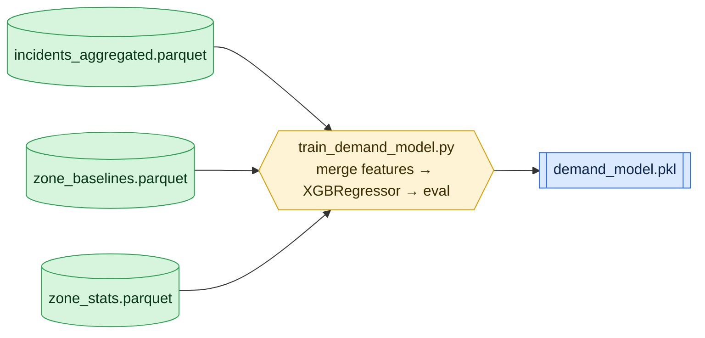

**Feature merge (Python):** join `zone_baseline_avg` on `(zone, hour, dayofweek)` and
`high_acuity_ratio, held_ratio` on `zone`; fill known defaults.

**FEATURE_COLS — frozen order (21):**

```
hour_sin, hour_cos, dow_sin, dow_cos, month_sin, month_cos, is_weekend,
temperature_2m, precipitation, windspeed_10m, is_severe_weather, svi_score,
zone_baseline_avg, high_acuity_ratio, held_ratio,           ← original 15
is_holiday, is_major_event, is_school_day,
is_heat_emergency, is_extreme_heat, subway_disruption_idx   ← +6 enrichment
```

**Model:** `XGBRegressor(n_estimators=300, max_depth=6, learning_rate=0.05,
subsample=0.8, colsample_bytree=0.8, random_state=42, tree_method="hist",
early_stopping_rounds=20)` — train on `split='train'`, eval on `split='test'`.

**Quality gate (assert in Python, or a downstream Quality Check on a metrics row):**
- Test RMSE < 4.0 incidents/zone/hour (warn >4, fail >6)
- `zone_baseline_avg` must land in top-3 feature importances (else merge broke)

---

## 7. Stage ⑥ — OSMnx Drive-Time Matrix  (`osmnx_drive_matrix`)

**Source script:** `pipeline/06_osmnx_matrix.py`
**Datamorph task type:** **Python** — runs in **parallel** from the start (~30–60 min).
**Output:** `drive_time_matrix.pkl` (+ cached `nyc_graph.pkl`, `zone_nodes.pkl`)

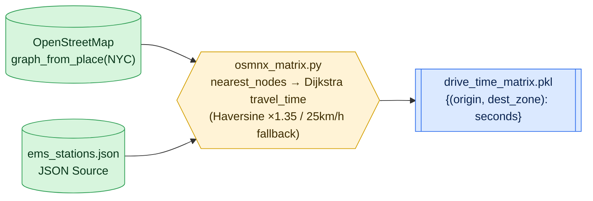

**What it produces:** `dict[(origin_key, dest_zone)] → seconds`, where `origin_key`
is a zone code (`'B2'`) or station id (`'EMS_M01'`). 31 zones + stations × 31 destinations.
**Fallback:** if OSMnx download fails, Haversine × 1.35 circuity ÷ 25 km/h (~15% less accurate).

> Pure graph computation — no SQL relation models a road network, so this stays Python.
> In the workflow DAG it has **no dependency on ①–⑤**; wire it parallel and let ⑦/⑧ wait on it.

---

## 8. Stage ⑦ — Staging Optimizer Validation  (`staging_optimizer_validate`)

**Source script:** `pipeline/07_staging_optimizer.py`
**Datamorph task type:** **Python**, used as a **Branch gate** — produces no artifact.
**Inputs:** `demand_model.pkl`, `zone_baselines.parquet`, `zone_stats.parquet`

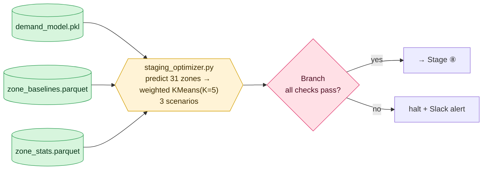

**Weighted K-Means staging** (the optimizer core, reused in ⑧):

```python
weights = np.array([max(predicted_counts[z], 0.01) for z in zones])
coords  = np.array([[CENTROID[z][1], CENTROID[z][0]] for z in zones])  # [lat, lon]
KMeans(n_clusters=K, random_state=42, n_init=20).fit(coords, sample_weight=weights)
```

**Gate checks (map to a `Branch` task):**
1. Friday 8PM top-5 demand ≥ 3 of 5 are B/K zones
2. Monday 4AM max demand < 8 incidents/hr
3. Friday-total / Monday-total demand ratio > 2.0×
4. ≥ 1 Friday staging point lands in a Bronx zone

---

## 9. Stage ⑧ — Counterfactual Pre-Computation  (`counterfactual_precompute`)

**Source script:** `pipeline/08_counterfactual_precompute.py`
**Datamorph task type:** **Python** — the headline-number generator.
**Inputs:** `demand_model.pkl`, `drive_time_matrix.pkl`, `zone_baselines.parquet`,
`zone_stats.parquet`, `incidents_cleaned.parquet`, `ems_stations.json`
**Outputs:** `counterfactual_summary.parquet` (168 rows), `counterfactual_raw.parquet`

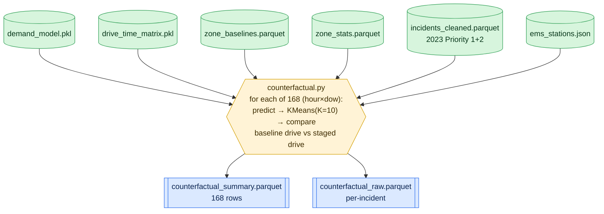

**Simulation logic per (hour × dow) bin (168 total, ≤150 incidents sampled each):**

| Step | What | Detail |
|------|------|--------|
| 1 | Filter 2023 incidents | `split='test' AND is_high_acuity=1`, this bin's `hour,dow` |
| 2 | Predict demand | XGBoost over 31 zones (Oct, normal-weekday defaults) |
| 3 | Stage | weighted K-Means, **K=10** → 10 staging zones |
| 4 | Baseline drive | real observed `INCIDENT_RESPONSE_SECONDS_QY` (fallback: nearest FDNY station via `dtm`) |
| 5 | Staged drive | `min(dtm[(staging_zone, incident_zone)])` over staging zones |
| 6 | Score | `seconds_saved`, `within_8min` (THRESHOLD = 480s), tag `svi_quartile` |

**Headline outputs (for Devpost / Impact Panel):**
- % within 8 min: **static ≈ 61% → staged ≈ 83%**
- Median seconds saved ≈ **147s**
- Largest equity gain in **SVI Q4** (most vulnerable) zones

**Final step → Notification:** `Tasks ▾ → Notifications → Slack`:
> `counterfactual AVAILABLE. 61%→83% within 8min, 147s saved. Bronx biggest gain.`

---

## 10. End-to-end lineage (single diagram)

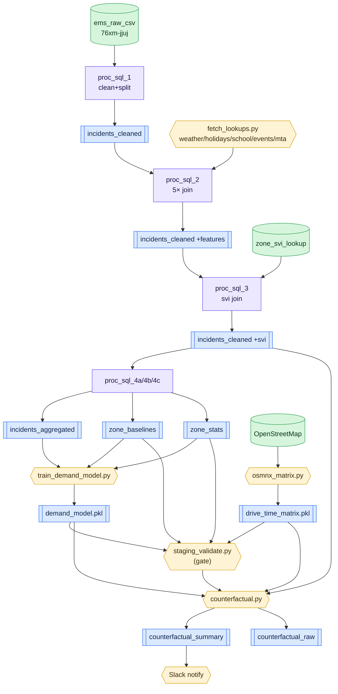

---

## 11. Build checklist — node inventory

Rebuild order on `app-v2.datamorph.ai`, workflow `test_predictive_ems_staging`:

| # | Datamorph task | Type | Nodes inside | Produces |
|---|----------------|------|--------------|----------|
| 1 | `duckdb_pipeline_01_ingest` | DuckDB Pipeline | CSV src · `proc_sql_1` · Quality · Parquet sink | `incidents_cleaned.parquet` |
| 2a | `fetch_lookups` | Python | — | 5 lookup Parquets |
| 2b | `weather_enrich` | DuckDB Pipeline | 6 Parquet src · `proc_sql_2` · Quality · sink | `incidents_cleaned.parquet` (+11 cols) |
| 3 | `duckdb_pipeline_03_svi` | DuckDB Pipeline | Parquet+JSON src · `proc_sql_3` · Quality · sink | `incidents_cleaned.parquet` (+svi) |
| 4 | `duckdb_pipeline_04_aggregate` | DuckDB Pipeline | Parquet src · `proc_sql_4a/4b/4c` · Quality · 3 sinks | `incidents_aggregated` · `zone_baselines` · `zone_stats` |
| 5 | `train_demand_model` | Python | — | `demand_model.pkl` |
| 6 | `osmnx_drive_matrix` | Python (parallel) | — | `drive_time_matrix.pkl` |
| 7 | `staging_optimizer_validate` | Python + Branch | — | gate (no artifact) |
| 8 | `counterfactual_precompute` | Python | — | `counterfactual_summary` · `counterfactual_raw` |
| 9 | `notify` | Slack | — | group-chat message |

**Source node paths to set:**

| Datamorph Source NAME | Type | Path / URL |
|------------------------|------|-----------|
| `ems_raw_csv` | CSV | `data.cityofnewyork.us/api/views/76xm-jjuj/rows.csv?accessType=DOWNLOAD` |
| `incidents_cleaned` | Parquet | `pipeline/data/incidents_cleaned.parquet` |
| `zone_svi_lookup` | JSON | `data/zone_svi_lookup.json` |
| `ems_stations` | JSON | `data/ems_stations.json` |
| `incidents_aggregated` | Parquet | `pipeline/data/incidents_aggregated.parquet` |
| `zone_baselines` | Parquet | `backend/artifacts/zone_baselines.parquet` |
| `zone_stats` | Parquet | `backend/artifacts/zone_stats.parquet` |

---

## 12. SQL-vs-Python decision rationale

| Stage | Operation | Datamorph node | Why |
|-------|-----------|----------------|-----|
| ① clean | filter + derive | **SQL** | pure relational SELECT/WHERE |
| ② enrich | 5 LEFT JOINs | **SQL** (+ Python prep) | join is SQL; API fetch/normalize is Python |
| ③ svi | LEFT JOIN | **SQL** | relational lookup |
| ④ aggregate | GROUP BY | **SQL** | aggregation + window-free rollups |
| ⑤ train | XGBoost | **Python** | gradient boosting, not expressible in SQL |
| ⑥ matrix | OSMnx + Dijkstra | **Python** | road-network graph algorithm |
| ⑦ optimize | weighted K-Means | **Python** | clustering |
| ⑧ counterfactual | KMeans + simulate | **Python** | per-incident simulation loop |

> Rule of thumb that matches datamorph's palette: **anything that's a `SELECT` belongs in a
> DuckDB Pipeline SQL processor; anything that fits a model, graph, or iterative simulation
> belongs in a Python task** that reads/writes the same Parquet/PKL relations.

---

_Generated from the live `pipeline/*.py` scripts. Field names, SQL filters, feature order,
and thresholds are copied verbatim from the source so the datamorph rebuild stays
byte-faithful to the original DuckDB pipeline._
