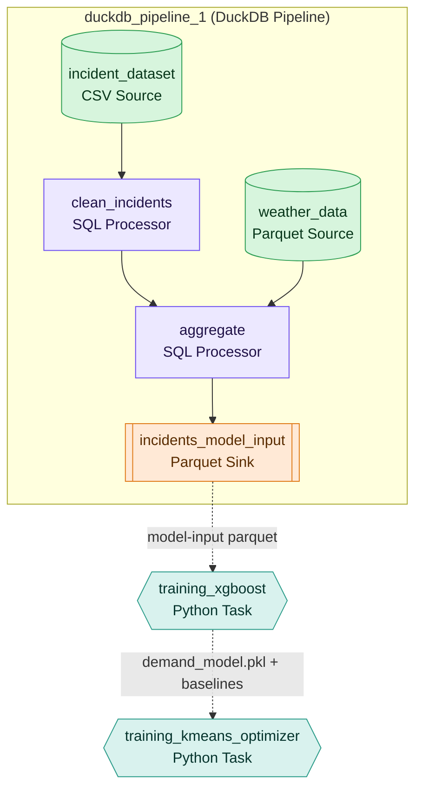

# FirstWave Pipeline — Explained & Transformed to Datamorph

> A holistic walkthrough of **what the FirstWave pipeline does**, **why it's built the way
> it is**, and **how it maps onto the datamorph.ai workflow** you've assembled
> (`test_predictive_ems_staging`).
>
> This is the narrative companion to the build assets in this folder. For the exact node
> SQL/Python see [`README.md`](README.md); for the full 8-stage version see
> [`DATAMORPH_PIPELINE_SIMULATION.md`](DATAMORPH_PIPELINE_SIMULATION.md); for the
> beginner build steps see [`SIMPLE_PIPELINE_GUIDE.md`](SIMPLE_PIPELINE_GUIDE.md).

---

## Part 1 — What FirstWave actually does

**The problem.** NYC EMS response times are too slow where it matters most. The Bronx
averages **638 seconds (10.6 min)** against an **8-minute (480s) clinical target**. The
issue isn't *too few* ambulances — it's *where idle ones wait*. They sit at fixed stations
while demand shifts by hour, day, and weather.

**The idea.** Predict where 911 calls will cluster in the next hour, then pre-position idle
units in the **mathematical center of predicted demand** before the wave hits.

**The pipeline that delivers it, in one sentence:**
> Clean the incident history → enrich it with the conditions that drive demand (weather,
> time, etc.) → aggregate it into a demand grid → **train a model to predict demand** →
> **optimize ambulance placement** against that prediction.

The first three steps are **data engineering** (relational, set-based). The last two are
**machine learning** (a regressor, then a clustering optimizer). That split is the single
most important thing to understand — because it's exactly what determines how each piece
maps onto datamorph.

---

## Part 2 — The transformation principle (one rule)

Datamorph gives you two kinds of building blocks:

| Datamorph primitive | Good at | FirstWave work it absorbs |
|---------------------|---------|---------------------------|
| **DuckDB Pipeline** (Source → SQL Processor → Sink) | filtering, joining, grouping — anything expressible as `SELECT` | clean, enrich, aggregate |
| **Python Task** (Airflow PythonOperator) | model fitting, iterative optimization, graph algorithms | XGBoost, K-Means |

**The rule we applied:**

> **If it's a `SELECT`, it's a SQL Processor inside a DuckDB Pipeline.
> If it fits a model or runs an optimization loop, it's a Python Task.**

Everything in your workflow follows from that one line. The cleaned/aggregated Parquet is
the **boundary** between the two worlds: SQL produces it, Python consumes it.

---

## Part 3 — Your built pipeline, node by node

This is what's on your canvas (`test_predictive_ems_staging`, env `TESTING`):



### The DuckDB Pipeline (`duckdb_pipeline_1`)
| Node (your label) | datamorph type | Role | Asset |
|-------------------|----------------|------|-------|
| `incident_dataset` | CSV Source | raw NYC EMS feed (`76xm-jjuj`) | — |
| `weather_data` | Parquet Source | hourly NYC weather (2023) | `weather_2023.parquet` |
| `clean_incidents` | SQL Processor | filter to valid 2023 rows; derive `zone, hour, date_hour` | [`simple_01_clean_incidents.sql`](sql/simple_01_clean_incidents.sql) |
| `aggregate` | SQL Processor | join weather on the hour; group to (zone, hour, dow); compute `zone_baseline_avg` | [`simple_03_model_input.sql`](sql/simple_03_model_input.sql) |
| `incidents_model_input` | Parquet Sink | the **model-input table** (the boundary) | `incidents_model_input.parquet` |

### The Python Tasks
| Task (your label) | Role | Reads | Writes | Script |
|-------------------|------|-------|--------|--------|
| `training_xgboost` | fit the demand forecaster | `incidents_model_input.parquet` | `simple_demand_model.pkl`, `simple_zone_baselines.parquet` | [`simple_train_xgboost.py`](python/simple_train_xgboost.py) |
| `training_kmeans_optimizer` | predict 31-zone demand for a scenario → weighted K-Means → staging points | model + baselines | `simple_staging.json` / `.parquet` | [`simple_kmeans_staging.py`](python/simple_kmeans_staging.py) |

**The solid arrows inside the box** are *data relations* (SQL node → SQL node).
**The dashed arrows between tasks** are *control dependencies* (run order) — `training_kmeans_optimizer`
waits for `training_xgboost` because it needs the `.pkl` the latter produces.

---

## Part 4 — How data flows across the boundary (the contract)

Each task hands the next a **file with a known schema**. That contract is what makes the
two halves snap together:

```
clean_incidents ──┐
                  ├─▶ aggregate ──▶ incidents_model_input.parquet
weather_data ─────┘                 cols: zone, hour, dayofweek, month, incident_date,
                                          incident_count (TARGET), temperature_2m,
                                          precipitation, is_severe_weather,
                                          zone_baseline_avg, is_weekend
                                            │
                                            ▼
                          training_xgboost ── reads that parquet
                                            ── fits XGBRegressor on 11 features
                                            ── writes simple_demand_model.pkl
                                                      simple_zone_baselines.parquet
                                            │
                                            ▼
                  training_kmeans_optimizer ── loads model + baselines
                                            ── predicts demand for ALL 31 zones (scenario)
                                            ── weighted K-Means over zone centroids
                                            ── writes simple_staging.json  (K staging points)
```

**Why `zone_baseline_avg` is the linchpin.** It's each zone's *typical* demand for a given
hour+day, computed in the `aggregate` SQL node. Without it the model has no per-zone signal —
it would predict the same number everywhere and K-Means would cluster meaninglessly. With
it, the model learns "B1 on a Friday at 8PM is busy" and the optimizer concentrates units
in the Bronx/Brooklyn. It is the bridge that carries spatial knowledge from SQL into the ML.

---

## Part 5 — Does it make sense? (validation + the gotchas)

**Yes — the structure is correct.** Dependency order is right, the SQL/Python split is
right, and the file contract is coherent. Three things to get right operationally:

### 5a. Shared storage for the handoff
Your tasks pass data as **files** (`*.parquet`, `*.pkl`). Airflow may run each task on a
different worker, so those files must live on storage **both tasks can see** — a mounted
volume or an object store (S3/GCS), not a worker-local `./backend/artifacts`. If
`training_kmeans_optimizer` errors with *"model not found,"* this is almost always why.
Point the scripts' output paths at your datamorph shared/persistent location.

### 5b. Use Keyword Arguments to drive the scenario
Your Python task panel shows `{"date": "{{ ds }}", "env": "prod"}`. Datamorph passes these
into the callable. The staging script currently reads the scenario from env vars
(`HOUR/DOW/MONTH/...`). Either keep env vars, or extend the script signature to accept the
kwargs (e.g. `def run(date=None, env="prod", hour=20, dow=4, ...)`) so you can change the
staging scenario from the UI without editing code. The `{{ ds }}` template gives you the
Airflow run date for free if you later want per-day staging.

### 5c. Inline code needs its imports + constants self-contained
You're using **Code Source: inline**, and the panel shows `ZONE_CENTROIDS` defined right in
the task. That's correct — inline tasks can't rely on local project imports, which is
exactly why the provided scripts inline their zone tables and `import` everything at top.
Keep `xgboost, scikit-learn, joblib, pandas, pyarrow` available in the execution image.

### 5d. Sanity check the output
On **Friday 8PM** (`HOUR=20 DOW=4`), the top predicted-demand zones and the staging points
should land in **B\*/K\*** (Bronx/Brooklyn). Re-run **Monday 4AM** (`HOUR=4 DOW=0`) and total
demand should collapse and staging spread out. That visible shift is the proof the model
learned real temporal structure — and it's the core of the demo.

---

## Part 6 — Mapping back to the original 8-stage pipeline

| Your datamorph node/task | Original FirstWave stage | What was simplified |
|--------------------------|--------------------------|---------------------|
| `clean_incidents` (SQL) | ① `01_ingest_clean.py` | 2023 only; fewer columns |
| `aggregate` (SQL) | ②+④ `02_weather_merge.py` + `04_aggregate.py` | weather only (no holidays/school/events/MTA/SVI) |
| `incidents_model_input` (sink) | ④ artifacts (`incidents_aggregated`, `zone_baselines`) | merged into one table |
| `training_xgboost` (Python) | ⑤ `05_train_demand_model.py` | 11 of 21 features, single-year split |
| `training_kmeans_optimizer` (Python) | ⑦ `07_staging_optimizer.py` | centroid distance, not OSMnx drive times |
| *(not built)* | ⑥ OSMnx matrix · ⑧ counterfactual | drive-time realism + before/after impact numbers |

**To grow it back toward full FirstWave**, add one node at a time:
1. Bring in [`seeds/zone_svi_lookup.json`](seeds/zone_svi_lookup.json) as a JSON Source and
   `LEFT JOIN` it in `aggregate` → adds the equity dimension (Stage ③).
2. Add the 6 calendar/MTA features via [`python/fetch_lookups.py`](python/fetch_lookups.py)
   + a join node → the full 21-feature model (Stage ②).
3. Replace centroid distance in the optimizer with the OSMnx drive-time matrix
   ([`python/osmnx_drive_matrix.py`](python/osmnx_drive_matrix.py)) → realistic coverage (Stage ⑥).
4. Add a counterfactual Python task ([`python/counterfactual_precompute.py`](python/counterfactual_precompute.py))
   → the "61% → 83% within 8 min, 147s saved" headline (Stage ⑧).

Each is the same pattern you already used: **a Source/SQL node if it's relational, a Python
task if it's a model or an optimization.**

---

## TL;DR

- Your pipeline is **correct and coherent**: SQL prep → XGBoost → K-Means, chained in the
  right order.
- The **cleaned/aggregated Parquet is the boundary** between data engineering (SQL) and ML
  (Python); `zone_baseline_avg` is the feature that carries spatial signal across it.
- Watch **shared storage** for the file handoffs, drive the **scenario via kwargs**, and keep
  **inline tasks self-contained** with their imports/constants.
- It's a faithful miniature of the full 8-stage FirstWave; the cut parts (SVI, full feature
  set, OSMnx drive times, counterfactual) are each one more node away.
