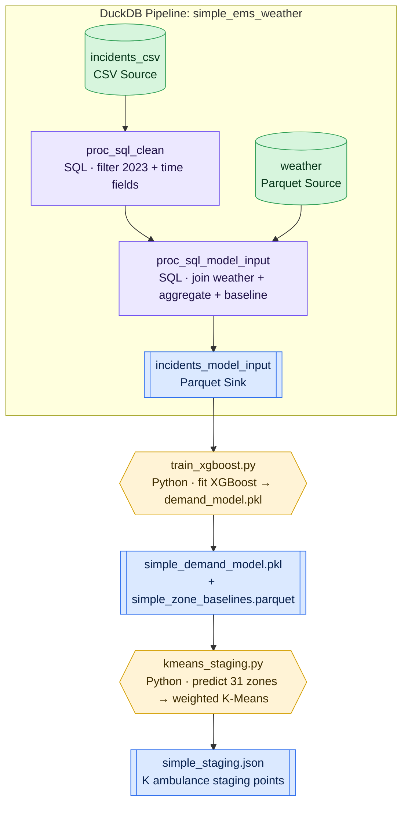

# Simple Pipeline Guide — Predict Demand & Stage Ambulances (Datamorph.ai)

> A beginner-friendly but **end-to-end** version of FirstWave you can build and run in
> ~30 minutes. Two datasets (NYC EMS incidents + hourly weather), and it goes all the
> way: **clean → aggregate (SQL) → XGBoost demand model (Python) → K-Means staging
> (Python) → ambulance staging points.**
>
> This is the real FirstWave thesis in miniature: *predict where 911 calls will cluster,
> then pre-position idle ambulances in the center of that predicted demand.*
>
> Full 8-stage version: [`DATAMORPH_PIPELINE_SIMULATION.md`](DATAMORPH_PIPELINE_SIMULATION.md)
> · Full rebuild kit: [`README.md`](README.md)

---

## 1. What we keep vs. cut

| Full FirstWave (8 stages) | This simple version |
|---------------------------|---------------------|
| Incidents + weather + holidays + school + events + MTA + SVI | **Incidents + weather only** |
| 5 years, 28.7M rows, train/test split | **2023 only**, ~1.5M rows (fast) |
| 21-feature XGBoost | **11-feature XGBoost** |
| OSMnx road graph + counterfactual simulation | **cut** (centroid distances only) |
| 4 DuckDB pipelines + 4 Python tasks | **1 DuckDB pipeline (3 SQL nodes) + 2 Python tasks** |

You still end with **real predicted demand and real staging coordinates** — the parts that
make the demo.

---

## 2. The shape of what we're building

The Parquet sink is **not** the end — it's the model-input table. From there, two Python
tasks do the machine learning.



**The handoff you asked about:** `incidents_model_input` (cleaned + aggregated demand
table) → **Python XGBoost** learns demand from time+weather → **Python K-Means** turns
those predictions into staging coordinates.

---

## 3. Before you start (prep the two inputs)

### 3a. Incident data
datamorph's CSV Source can read straight from the NYC Open Data URL:
```
https://data.cityofnewyork.us/api/views/76xm-jjuj/rows.csv?accessType=DOWNLOAD
```
> ~2 GB. If streaming is flaky, download once and point the CSV Source at a local copy.

### 3b. Weather data
Run the helper once → clean Parquet the `weather` Source reads:
```bash
cd /Users/vaibhav.wudaru/hacklytics/FirstWave
python datamorph/python/fetch_weather_simple.py     # -> pipeline/data/weather_2023.parquet
```
(No-code alternative: the Open-Meteo CSV URL — see §7 troubleshooting.)

---

## 4. Part A — the SQL pipeline (3 nodes → model input)

> Toolbar menus match your workspace: `Source ▾`, `Processor ▾`, `Sink ▾`.

### Step 0 — New workflow + pipeline
1. **Workflows → New**, name it `simple_ems_weather`.
2. `Tasks ▾ → Pipelines → DuckDB Pipeline`. Open the `duckdb_pipeline_1` card.

### Step 1 — incident Source
`Source ▾ → FILE → CSV` · **NAME** = `incidents_csv` · **Path/URL** = EMS URL from §3a.

### Step 2 — clean processor
`Processor ▾ → SQL → SQL` · **NAME** = `proc_sql_clean` · **SQL RELATIONS** = `incidents_csv` ·
paste [`sql/simple_01_clean_incidents.sql`](sql/simple_01_clean_incidents.sql).

### Step 3 — weather Source
`Source ▾ → FILE → Parquet` · **NAME** = `weather` · **Path** = `pipeline/data/weather_2023.parquet`.

### Step 4 — model-input processor (join + aggregate + baseline)
`Processor ▾ → SQL → SQL` · **NAME** = `proc_sql_model_input` ·
**SQL RELATIONS** = `proc_sql_clean, weather` · paste
[`sql/simple_03_model_input.sql`](sql/simple_03_model_input.sql).

### Step 5 — sink
`Sink ▾ → FILE → Parquet` · **NAME** = `incidents_model_input` ·
**Path** = `pipeline/data/incidents_model_input.parquet` · input = `proc_sql_model_input`.

### Step 6 — Validate · Run · Save
The sink now holds one row per **(zone, hour, dayofweek, date)** with `incident_count`
(the target), that hour's weather, and `zone_baseline_avg` (the per-zone demand prior).

---

## 5. Part B — the Machine Learning (2 Python tasks)

These are the steps you flagged as missing. Add each as `Tasks ▾ → Actions → Python`,
wired **after** the pipeline.

### Step 7 — XGBoost demand model
Add a Python action `train_xgboost`, paste
[`python/simple_train_xgboost.py`](python/simple_train_xgboost.py).

What it does:
1. Reads `incidents_model_input.parquet`.
2. Builds 11 features — cyclical `hour/dow/month` (sin+cos), `is_weekend`,
   `temperature_2m`, `precipitation`, `is_severe_weather`, and `zone_baseline_avg`
   (the strongest signal: each zone's typical demand for that hour+day).
3. Trains `XGBRegressor` (200 trees, depth 5), 80/20 split, prints test **RMSE**.
4. Saves `simple_demand_model.pkl` **and** `simple_zone_baselines.parquet`
   (the baseline lookup the staging step needs for inference).

```
FEATURE_COLS = [hour_sin, hour_cos, dow_sin, dow_cos, month_sin, month_cos,
                is_weekend, temperature_2m, precipitation, is_severe_weather,
                zone_baseline_avg]
target = incident_count
```

Run it standalone to verify:
```bash
python datamorph/python/simple_train_xgboost.py
```

### Step 8 — weighted K-Means staging
Add a Python action `kmeans_staging`, paste
[`python/simple_kmeans_staging.py`](python/simple_kmeans_staging.py).

What it does:
1. Loads the model + baseline lookup.
2. Predicts demand for **all 31 zones** for a scenario (default **Friday 8PM, Oct**;
   override via env vars `HOUR/DOW/MONTH/TEMP/PRECIP/K`).
3. Runs **weighted K-Means** over the 31 zone centroids, weighting each by predicted
   demand — clusters land where the calls will be.
4. Writes `simple_staging.json` / `.parquet` — K staging points with lat/lon, nearest
   zone, the zones each covers, and total demand covered.

```python
weights = [max(predicted_counts[z], 0.01) for z in zones]
coords  = [[lat, lon] for z in zones]
KMeans(n_clusters=K, random_state=42, n_init=20).fit(coords, sample_weight=weights)
```

Run it standalone:
```bash
python datamorph/python/simple_kmeans_staging.py
# Friday 8PM with 7 ambulances in the rain:
HOUR=20 DOW=4 K=7 PRECIP=8 python datamorph/python/simple_kmeans_staging.py
```

---

## 6. What you should see

**XGBoost step** — test RMSE printed; `zone_baseline_avg` should be the #1 feature by
importance (it's the demand prior that lets the model tell zones apart).

**K-Means step** — something like:
```
Scenario: hour=20 dow=4 month=10 ... K=5
Top-5 demand zones:  B1: 14.8   B2: 12.1   K4: 10.7   K3: 9.9   B3: 9.2
5 staging points:
  [0] B2  (lon=-73.92, lat=40.84) — 6 zones, demand 41.3
  [1] K4  (lon=-73.91, lat=40.66) — 7 zones, demand 38.0
  ...
```

**The result that proves it works:** on **Friday 8PM**, the high-demand zones and the
staging points concentrate in **Bronx (B*) and Brooklyn (K*)** — exactly the boroughs with
the worst real response times. Re-run for **Monday 4AM** (`HOUR=4 DOW=0`) and demand
collapses and staging spreads out. That shift *is* the FirstWave argument.

---

## 7. Node inventory

| # | Node / Task | Type | NAME | Reads | Writes |
|---|-------------|------|------|-------|--------|
| 1 | Source | CSV | `incidents_csv` | NYC `76xm-jjuj` URL | — |
| 2 | Processor | SQL | `proc_sql_clean` | `incidents_csv` | — |
| 3 | Source | Parquet | `weather` | `weather_2023.parquet` | — |
| 4 | Processor | SQL | `proc_sql_model_input` | `proc_sql_clean, weather` | — |
| 5 | Sink | Parquet | `incidents_model_input` | `proc_sql_model_input` | `incidents_model_input.parquet` |
| 6 | Task | Python | `train_xgboost` | `incidents_model_input.parquet` | `simple_demand_model.pkl`, `simple_zone_baselines.parquet` |
| 7 | Task | Python | `kmeans_staging` | model + baselines | `simple_staging.json/.parquet` |

Files in this kit:
- SQL: [`simple_01_clean_incidents.sql`](sql/simple_01_clean_incidents.sql) ·
  [`simple_03_model_input.sql`](sql/simple_03_model_input.sql)
- Python: [`fetch_weather_simple.py`](python/fetch_weather_simple.py) ·
  [`simple_train_xgboost.py`](python/simple_train_xgboost.py) ·
  [`simple_kmeans_staging.py`](python/simple_kmeans_staging.py)
- (Optional side-analysis: [`simple_02_join_weather_agg.sql`](sql/simple_02_join_weather_agg.sql) — the wet/dry response-time summary, if you also want that chart.)

---

## 8. Troubleshooting

| Symptom | Cause | Fix |
|---------|-------|-----|
| Join gives all-NULL weather | timestamp mismatch | both sides must be hour TIMESTAMPs, same timezone (America/New_York); `proc_sql_clean` uses `date_trunc('hour', …)` |
| `incident_count` absurdly large | missing 2023 filter | keep `EXTRACT(year …) = 2023` in `proc_sql_clean` |
| XGBoost: predictions identical across zones | `zone_baseline_avg` dropped | it must be in `FEATURE_COLS`; it's the only per-zone signal |
| K-Means staging all in one spot | weights ~equal | check the model actually varies by zone (see row above) |
| `ModuleNotFoundError: xgboost` | sandbox missing dep | `pip install xgboost scikit-learn joblib pandas pyarrow` |
| Weather CSV has junk header rows | Open-Meteo CSV metadata | use the Parquet helper (§3b), or set CSV skip-rows until the `time` row |

---

## 9. How this maps back to full FirstWave

| This simple step | Full pipeline equivalent |
|------------------|--------------------------|
| `proc_sql_clean` | Stage ① `01_ingest_clean.py` (trimmed) |
| `proc_sql_model_input` | Stages ②+④ `02_weather_merge.py` + `04_aggregate.py` (weather only) |
| `train_xgboost.py` | Stage ⑤ `05_train_demand_model.py` (11 of 21 features) |
| `kmeans_staging.py` | Stage ⑦ `07_staging_optimizer.py` |
| *(cut)* | Stage ⑥ OSMnx + Stage ⑧ counterfactual |

To grow it back: add the SVI seed ([`seeds/zone_svi_lookup.json`](seeds/zone_svi_lookup.json))
and the 6 calendar/MTA features, swap centroid distance for the OSMnx drive-time matrix,
then layer the counterfactual (`08`) on top for the before/after impact numbers.
